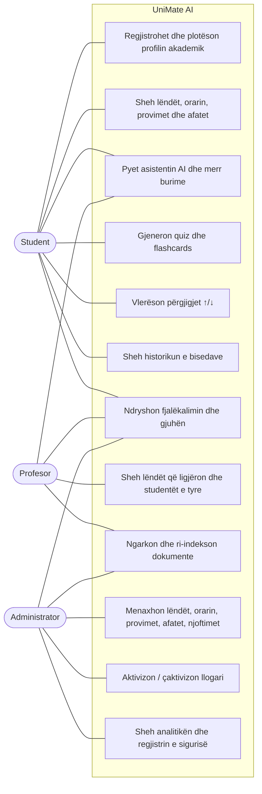
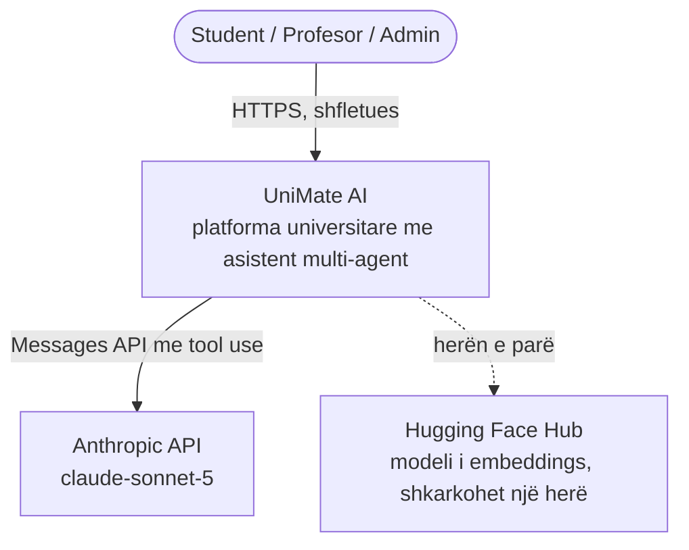
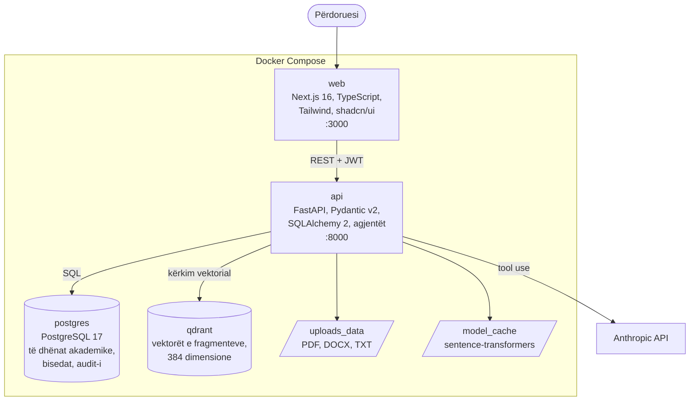
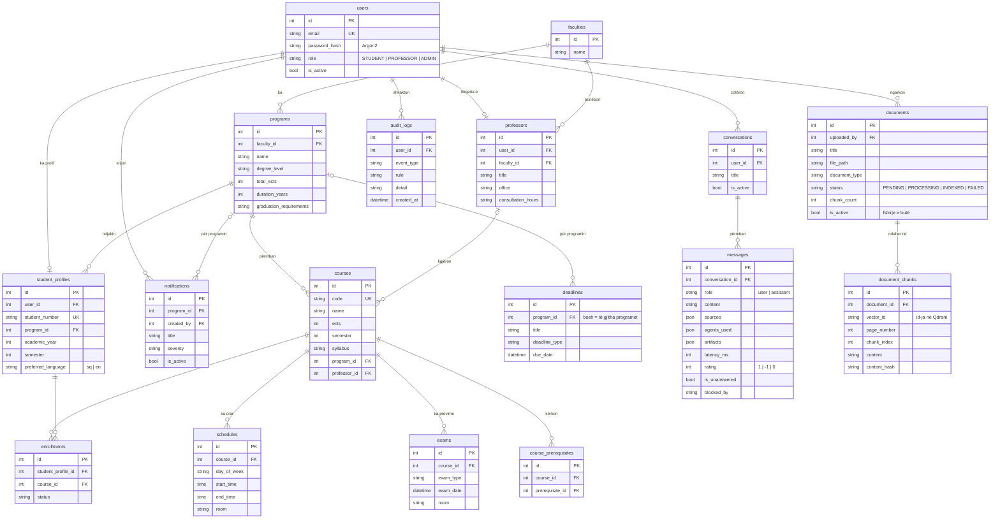
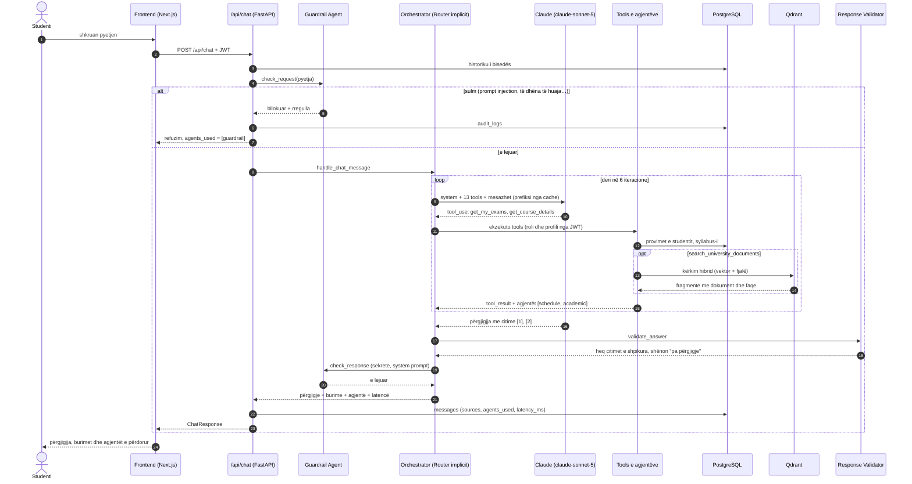
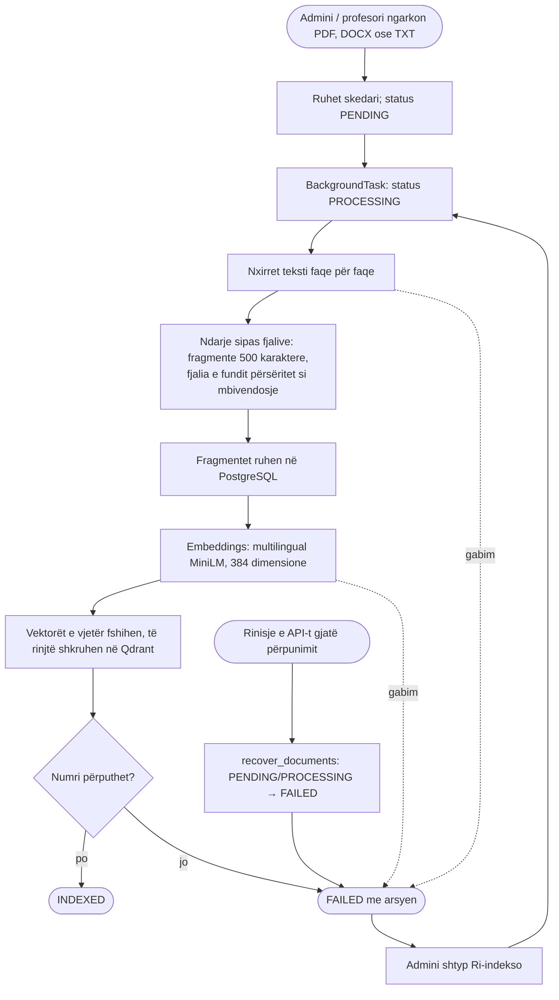
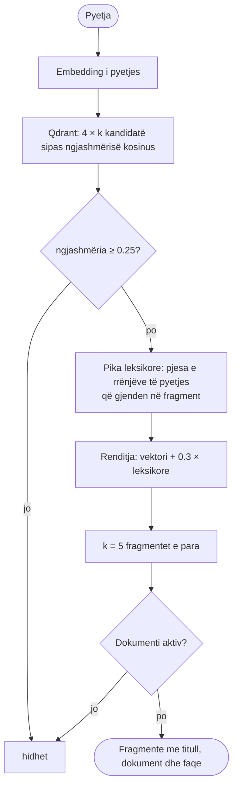
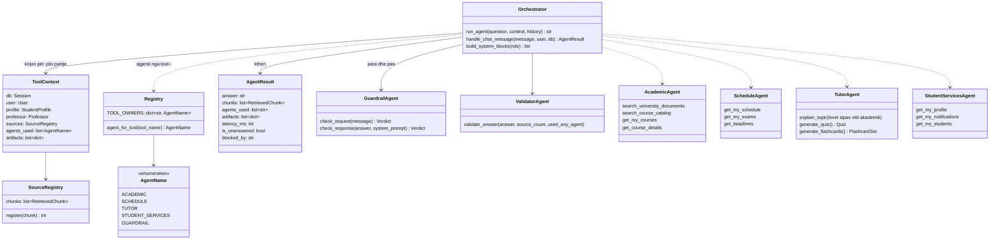

# UniMate AI — diagramet e sistemit

Diagramet ndjekin kodin ashtu siç është në repo. Janë në Mermaid: VS Code
(me shtesën *Markdown Preview Mermaid Support*) dhe GitHub i shfaqin
drejtpërdrejt. Për Word, hap diagramin te <https://mermaid.live>, ngjit
kodin dhe eksportoje si PNG ose SVG.

Përmbajtja:

1. Use Case — kush çfarë bën
2. C4 — konteksti dhe kontejnerët
3. ER — skema e bazës së të dhënave
4. Sequence — rruga e një pyetjeje nëpër agjentë
5. Activity — pipeline-i i dokumenteve dhe kërkimi hibrid
6. Class — modulet e agjentëve

---

## 1. Use Case

Tre rolet e temës. Rolet i cakton JWT-ja; asnjë endpoint nuk pranon rol
nga trupi i kërkesës.

---

## 2. C4

### Niveli 1 — Konteksti

### Niveli 2 — Kontejnerët (`docker-compose.yml`)

---

## 3. ER — skema e bazës

17 tabela, të krijuara nga 11 migrime Alembic. `PK` = çelës primar,
`FK` = çelës i huaj.

---

## 4. Sequence — një pyetje nëpër agjentë

Shembull: *"Kur e kam provimin e Algoritmeve dhe çfarë duhet të mësoj?"*
Modeli thërret tools të dy agjentëve në të njëjtën përgjigje.

---

## 5. Activity — dokumentet dhe kërkimi

### Pipeline-i i ingestimit

### Kërkimi hibrid

---

## 6. Class — agjentët

Router Agent-i është implicit: modeli zgjedh tools, dhe `TOOL_OWNERS`
tregon cilit agjent i përket secili tool. Kështu çdo përgjigje ruan
saktësisht cilët agjentë e trajtuan.

